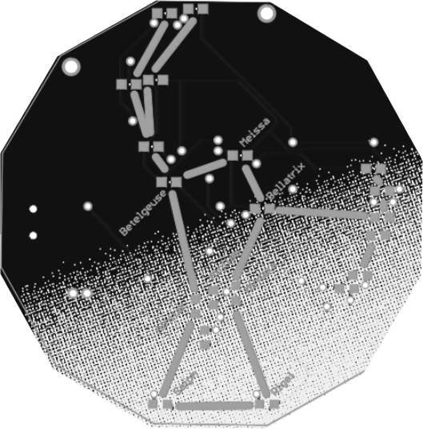

Orion PCB
===

The layout is based on [Orion constellation with star labels](https://commons.wikimedia.org/wiki/File:Orion_constellation_with_star_labels.jpg) by Anirban Nandi(CC-BY).

Firmware and schematic is based on [20 LED charlieplexed pendant](https://github.com/osresearch/pendant).
